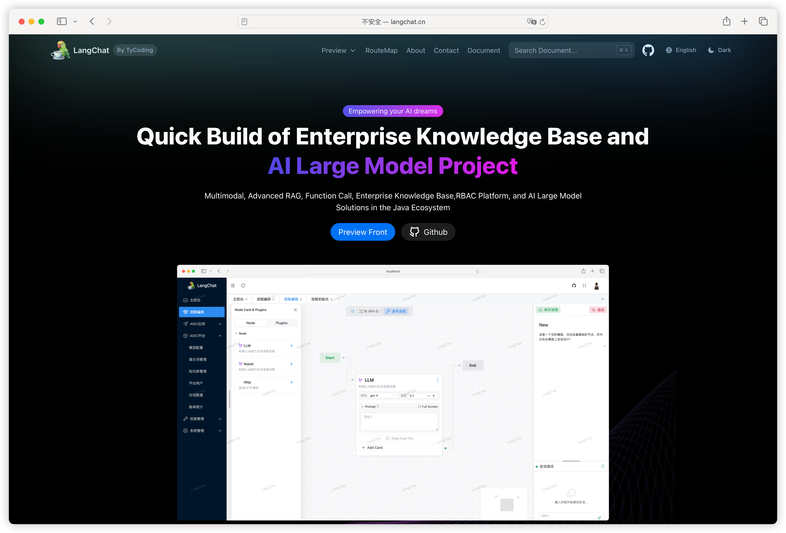
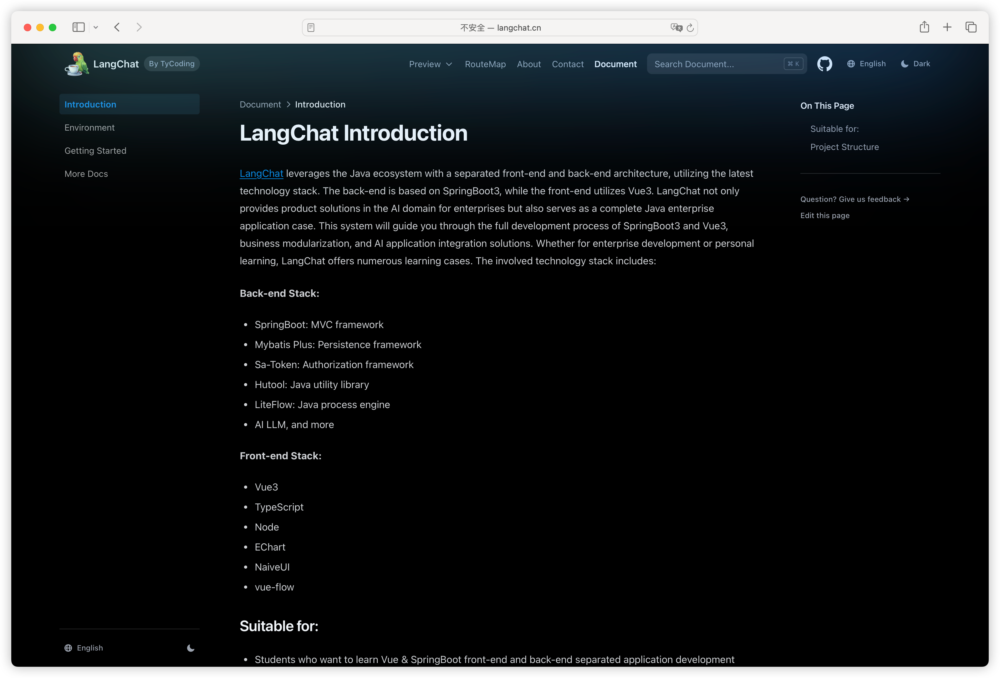
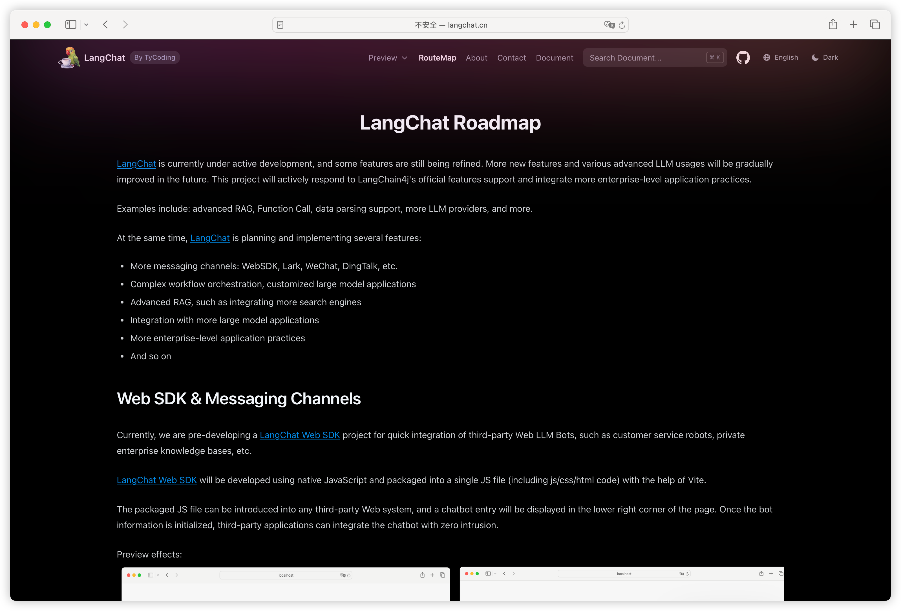

# LangChat.cn

Project repository: [https://github.com/tycoding/langchat](https://github.com/tycoding/langchat)

Preview online：[https://langchat.cn](https://langchat.cn)

Based on:

- Nextra
- React
- Tailwind

由于作者精力有限，开发文档会有所欠缺，可以加入我的Java微信交流群：LangChainChat（备注：闲聊）。

如果你有关于LangChat的开发问题或者二开定制等需求，或者想要深入交流Java生态AIGC产品开发、产品变现等，也可以请作者喝一杯咖啡加入我的LangChat交流群（可以一起交流LangChat后续开发规划）：

添加微信：LangChainChat（备注：赞助）

## Preview

## 合作 & 赞助

进微信vip交流群，添加微信：LangChainChat（备注：赞助）

## License

This project is licensed under the MIT License.
